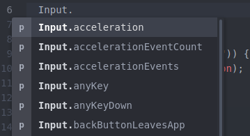

# autocomplete-unity

Unity autocomplete.  

Using [atom-autocomplete-boilerplate](https://github.com/lonekorean/atom-autocomplete-boilerplate) as base.  

## Installation
There are several ways to install depending on what you prefer

#### Atom installation
* In Atom, you should search for the package *autocomplete-unity* and install.
  * On Mac, you'll find it under Atom &gt; Preferences... &gt; Install.
  * On Windows, you'll find it under File &gt; Settings &gt; Install.
  * On Ubuntu, you'll find it under Edit &gt; Preferences &gt; Install.

#### Terminal installation
* Make sure you have apm installed.
  * On Mac, you might need to start Atom and go to Atom &gt; Install Shell Commands.
  * On Windows/Ubuntu, it's probably already there.
* Open your terminal, then run `apm install autocomplete-unity`.

#### Development installation
* Clone this repo.
* Make sure you have apm installed.
  * On Mac, you might need to start Atom and go to Atom &gt; Install Shell Commands.
  * On Windows/Ubuntu, it's probably already there.
* Open your terminal, navigate into the repo directory, then run `apm link`.

**Observation**  
* Don't forget to reload Atom when you make changes!
  * On Mac, hit `ctrl` + `option` + `command` + `L`.
  * On Windows/Ubuntu, hit `ctrl` + `shift` + `F5`.

#### Installed
* In Atom, you should now see *autocomplete-unity* installed.
  * On Mac, you'll find it under Atom &gt; Preferences... &gt; Packages &gt; Community Packages.
  * On Windows, you'll find it under File &gt; Settings &gt; Packages &gt; Community Packages.
  * On Ubuntu, you'll find it under Edit &gt; Preferences &gt; Packages &gt; Community Packages.  
